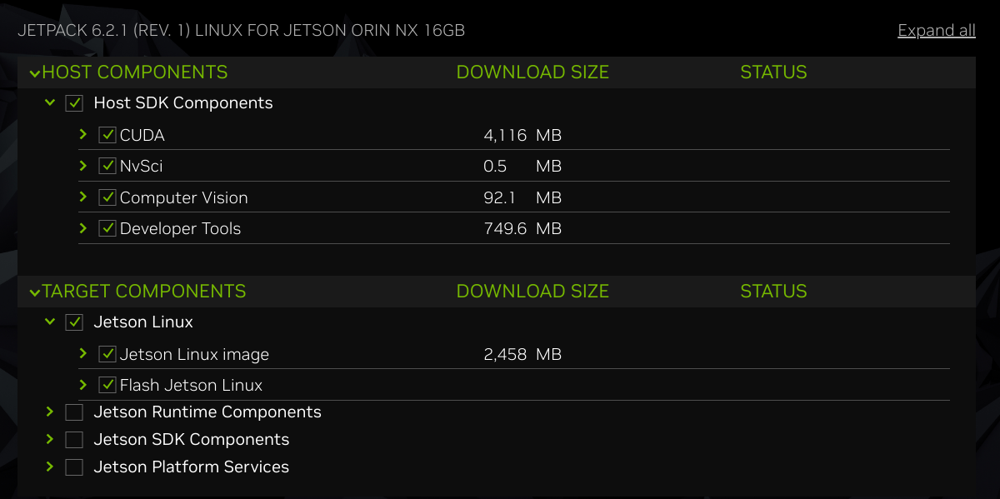

# using sdk




dw folder           : /home/user/Downloads/nvidia/sdkm_downloads
sdk install folder  : /home/user/nvidia/nvidia_sdk 


## target : after burn

* ip 192.168.55.1
* on device:

```

cat /etc/issue
Ubuntu 22.04.5 LTS \n \l

cat /proc/device-tree/model
NVIDIA Jetson Orin NX Engineering Reference Developer Kit

uname -a
Linux ubuntu 5.15.148-tegra #1 SMP PREEMPT Mon Jun 16 08:24:48 PDT 2025 aarch64 aarch64 aarch64 GNU/Lin


```


## host: sdkm_downloads

```
~/Downloads/nvidia/sdkm_downloads   (7.3G)
.
├── hwdata
│   ├── families
│   │   ├── aerial
│   │   │   ├── devices
│   │   │   │   ├── dell-poweredge-target.json
│   │   │   │   ├── dell-r750-a100x-target.json
│   │   │   │   ├── dell-s5248f-on.json
│   │   │   │   ├── foxconn-oru.json
│   │   │   │   ├── gigabyte-edge-target.json
│   │   │   │   ├── gigabyte-no-gpu-target.json
│   │   │   │   ├── supermicro-gh-5gc-target.json
│   │   │   │   └── supermicro-gh-mgx-target.json
│   │   │   └── series
│   │   │       ├── 5gc-targets.json
│   │   │       ├── fronthaul-switch-targets.json
│   │   │       ├── gnb-targets.json
│   │   │       └── oru-targets.json
│   │   ├── doca
│   │   │   ├── devices
│   │   │   │   ├── bluefield2-controller-card.json
│   │   │   │   ├── bluefield2-controller-vpi-card.json
│   │   │   │   ├── bluefield2-dpu-100gbe.json
│   │   │   │   ├── bluefield2-dpu-100gbe-vpi.json
│   │   │   │   ├── bluefield2-dpu-200gbe.json
│   │   │   │   ├── bluefield2-dpu-25gbe.json
│   │   │   │   ├── bluefield2-dpu-bmc-100gbe.json
│   │   │   │   ├── bluefield2-dpu-bmc-100gbe-vpi.json
│   │   │   │   ├── bluefield2-dpu-bmc-25gbe.json
│   │   │   │   ├── bluefield3-dpu-bmc-100gbe.json
│   │   │   │   ├── bluefield3-dpu-bmc-100gbe-vpi.json
│   │   │   │   ├── bluefield3-dpu-bmc-200gbe.json
│   │   │   │   ├── bluefield3-dpu-bmc-200gbe-vpi.json
│   │   │   │   ├── bluefield3-dpu-bmc-400gbe-vpi.json
│   │   │   │   ├── nvidia-converged-accelerator-a100x.json
│   │   │   │   ├── nvidia-converged-accelerator-a30x.json
│   │   │   │   └── nvidia-converged-accelerator-a800x.json
│   │   │   └── series
│   │   │       ├── bluefield2-controller-targets.json
│   │   │       ├── bluefield2-controller-vpi-targets.json
│   │   │       ├── bluefield2-dpu-targets.json
│   │   │       ├── bluefield2-dpu-vpi-targets.json
│   │   │       ├── bluefield3-dpu-targets.json
│   │   │       ├── bluefield3-dpu-vpi-targets.json
│   │   │       └── nvidia-converged-accelerator-targets.json
│   │   ├── drive
│   │   │   ├── devices
│   │   │   │   ├── ddpx.json
│   │   │   │   ├── drive-agx-orin.json
│   │   │   │   ├── drive-agx-pegasus-xt.json
│   │   │   │   ├── px2-autochauffeur.json
│   │   │   │   └── px2-autocruise.json
│   │   │   └── series
│   │   │       ├── drive-agx-orin-devkits.json
│   │   │       ├── drive-agx-xavier-devkits.json
│   │   │       └── drive-px2-devkits.json
│   │   ├── holoscan
│   │   │   ├── devices
│   │   │   │   ├── clara-agx-devkit.json
│   │   │   │   ├── igx-orin-devkit-dgpu-ada-a6000.json
│   │   │   │   ├── igx-orin-devkit-dgpu-ampere-a6000.json
│   │   │   │   ├── igx-orin-devkit-es.json
│   │   │   │   ├── igx-orin-devkit-igpu.json
│   │   │   │   ├── jetson-agx-xavier-ind.json
│   │   │   │   ├── jetson-agx-xavier.json
│   │   │   │   ├── jetson-nano-2gb-devkit.json
│   │   │   │   ├── jetson-nano-devkit.json
│   │   │   │   └── jetson-nano.json
│   │   │   └── series
│   │   │       ├── clara-agx-devkit-targets.json
│   │   │       ├── igx-orin-devkit-dgpu-targets.json
│   │   │       ├── igx-orin-devkit-es-targets.json
│   │   │       ├── igx-orin-devkit-igpu-targets.json
│   │   │       ├── jetson-agx-xavier-targets.json
│   │   │       └── jetson-nano-targets.json
│   │   ├── jetson
│   │   │   ├── devices
│   │   │   │   ├── clara-agx-devkit.json
│   │   │   │   ├── jetson-agx-orin-32gb-devkit.json
│   │   │   │   ├── jetson-agx-orin-32gb.json
│   │   │   │   ├── jetson-agx-orin-64gb-devkit.json
│   │   │   │   ├── jetson-agx-orin-64gb.json
│   │   │   │   ├── jetson-agx-orin-ind-64gb.json
│   │   │   │   ├── jetson-agx-thor-devkit.json
│   │   │   │   ├── jetson-agx-xavier-ind.json
│   │   │   │   ├── jetson-agx-xavier.json
│   │   │   │   ├── jetson-nano-2gb-devkit.json
│   │   │   │   ├── jetson-nano-devkit.json
│   │   │   │   ├── jetson-nano.json
│   │   │   │   ├── jetson-orin-nano-4gb.json
│   │   │   │   ├── jetson-orin-nano-8gb-devkit.json
│   │   │   │   ├── jetson-orin-nano-8gb.json
│   │   │   │   ├── jetson-orin-nx-16gb.json
│   │   │   │   ├── jetson-orin-nx-8gb.json
│   │   │   │   ├── jetson-tx1.json
│   │   │   │   ├── jetson-tx2-4gb.json
│   │   │   │   ├── jetson-tx2i.json
│   │   │   │   ├── jetson-tx2.json
│   │   │   │   ├── jetson-tx2-nx.json
│   │   │   │   ├── jetson-xavier-nx-devkit.json
│   │   │   │   └── jetson-xavier-nx.json
│   │   │   └── series
│   │   │       ├── clara-agx-devkit-targets.json
│   │   │       ├── jetson-agx-orin-targets.json
│   │   │       ├── jetson-agx-thor-targets.json
│   │   │       ├── jetson-agx-xavier-targets.json
│   │   │       ├── jetson-nano-targets.json
│   │   │       ├── jetson-orin-nano-targets.json
│   │   │       ├── jetson-orin-nx-targets.json
│   │   │       ├── jetson-tx1-targets.json
│   │   │       ├── jetson-tx2-targets.json
│   │   │       └── jetson-xavier-nx-targets.json
│   │   └── switch
│   │       ├── devices
│   │       │   ├── switch-msn2010-18.json
│   │       │   ├── switch-msn2100-16.json
│   │       │   ├── switch-msn2201.json
│   │       │   ├── switch-msn2410-48.json
│   │       │   ├── switch-msn2700-32.json
│   │       │   ├── switch-msn3420-60.json
│   │       │   ├── switch-msn3700-32.json
│   │       │   ├── switch-msn3750.json
│   │       │   ├── switch-msn3800.json
│   │       │   ├── switch-msn4280.json
│   │       │   ├── switch-msn4410.json
│   │       │   ├── switch-msn4600-64.json
│   │       │   ├── switch-msn4700-32.json
│   │       │   ├── switch-msn4800-128.json
│   │       │   ├── switch-msn5400.json
│   │       │   ├── switch-msn5600.json
│   │       │   ├── switch-msn5610.json
│   │       │   └── switch-msn5640.json
│   │       └── series
│   │           ├── switch-2xxx-targets.json
│   │           ├── switch-3xxx-targets.json
│   │           ├── switch-4xxx-targets.json
│   │           └── switch-5xxx-targets.json
│   ├── sdkml1_repo_hw.json
│   ├── sdkml2_aerial_hw.json
│   ├── sdkml2_doca_hw.json
│   ├── sdkml2_drive_hw.json
│   ├── sdkml2_holoscan_hw.json
│   ├── sdkml2_jetson_hw.json
│   └── sdkml2_switch_hw.json
├── Jetson_Linux_R36.4.4_aarch64.tbz2
├── l4t-cuda-repo-cross-aarch64-ubuntu2204-12-6-local_12.6.11-1_all.deb
├── l4t-cuda-repo-ubuntu2204-12-6-local_12.6.11-560.35.03-1_amd64.deb
├── NsightSystems-linux-public-DVS-2024.5.4.34-3485573.deb
├── NVIDIA_Nsight_Graphics_L4T_Public_2024.2.24327_x64.deb
├── NVIDIA_Nsight_Perf_SDK_2023.5.0_L4T.tar.gz
├── NVIDIA_Nsight_Perf_SDK_Docs_2023.5.0.zip
├── nvsci_pkg_x86_64_rel-36_20240822_37344366.deb
├── sdkml3_jetpack_621_b211.json
├── Tegra_Linux_Sample-Root-Filesystem_R36.4.4_aarch64.tbz2
├── vpi-cross-aarch64-l4t-3.2.4-cuda12-x86_64-linux.deb
├── vpi-dev-3.2.4-cuda12-x86_64-linux.deb
├── vpi-lib-3.2.4-cuda12-x86_64-linux.deb
├── vpi-python3.10-3.2.4-cuda12-x86_64-linux.deb
├── vpi-python-src-3.2.4-cuda12-x86_64-linux.deb
└── vpi-samples-3.2.4-cuda12-x86_64-linux.deb

```


## nvidia_sdk


```

/home/user/nvidia/nvidia_sdk (24G)


├── JetPack_6.2.1_Linux
│   └── NVIDIA_Nsight_Perf_SDK
│       ├── Nsight Perf SDK for Tegra Getting Started Guide 2023.5 (rev5).pdf
│       ├── Nsight Perf SDK for Tegra Release Notes.pdf
│       ├── NvPerf
│       ├── redist
│       └── Samples
└── JetPack_6.2.1_Linux_JETSON_ORIN_NX_TARGETS
    └── Linux_for_Tegra
        ├── apply_binaries.sh
        ├── bootloader
        ├── build_l4t_bup.sh
        ├── flash.sh
        ├── generate_capsule
        ├── igx-orin-devkit.conf -> p3740-0002-p3701-0008.conf
        ├── initrdlog
        ├── jetson_additional_board_spec.cfg
        ├── jetson-agx-orin-devkit-as-jao-32gb.conf -> p3737-0000-p3701-0000-as-p3701-0004.conf
        ├── jetson-agx-orin-devkit-as-nano4gb.conf -> p3737-0000-p3701-0000-as-p3767-0004.conf
        ├── jetson-agx-orin-devkit-as-nano8gb.conf -> p3737-0000-p3701-0000-as-p3767-0003.conf
        ├── jetson-agx-orin-devkit-as-nx-16gb.conf -> p3737-0000-p3701-0000-as-p3767-0000.conf
        ├── jetson-agx-orin-devkit-as-nx-8gb.conf -> p3737-0000-p3701-0000-as-p3767-0001.conf
        ├── jetson-agx-orin-devkit.conf -> p3737-0000-p3701-0000.conf
        ├── jetson-agx-orin-devkit-industrial.conf -> p3737-0000-p3701-0008.conf
        ├── jetson-agx-orin-devkit-industrial-maxn.conf -> p3737-0000-p3701-0008-maxn.conf
        ├── jetson-agx-orin-devkit-industrial-qspi.conf -> p3737-0000-p3701-0008-qspi.conf
        ├── jetson-agx-orin-devkit-maxn.conf -> p3737-0000-p3701-0000-maxn.conf
        ├── jetson_board_spec.cfg
        ├── jetson-orin-nano-devkit.conf -> p3768-0000-p3767-0000-a0.conf
        ├── jetson-orin-nano-devkit-nvme.conf -> p3768-0000-p3767-0000-a0-nvme.conf
        ├── jetson-orin-nano-devkit-super.conf -> p3768-0000-p3767-0000-super.conf
        ├── jetson-orin-nano-devkit-super-maxn.conf -> p3768-0000-p3767-0000-super-maxn.conf
        ├── jetson-orin-nano-devkit-super-maxn-nvme.conf -> p3768-0000-p3767-0000-super-maxn-nvme.conf
        ├── jetson-orin-nano-devkit-super-nvme.conf -> p3768-0000-p3767-0000-super-nvme.conf
        ├── kernel
        ├── l4t_generate_soc_bup.sh
        ├── l4t_sign_image.sh
        ├── l4t_uefi_sign_image.sh
        ├── nvautoflash.sh
        ├── nvmassfusegen.sh
        ├── nvsdkmanager_flash.sh
        ├── nv_tegra
        ├── nv_tools
        ├── odmfuse.func
        ├── odmfuseread.sh
        ├── odmfuse.sh
        ├── p3509-a02-p3767-0000.conf
        ├── p3701.conf.common
        ├── p3737-0000-p3701-0000-as-p3701-0004.conf
        ├── p3737-0000-p3701-0000-as-p3767-0000.conf
        ├── p3737-0000-p3701-0000-as-p3767-0001.conf
        ├── p3737-0000-p3701-0000-as-p3767-0003.conf
        ├── p3737-0000-p3701-0000-as-p3767-0004.conf
        ├── p3737-0000-p3701-0000.conf
        ├── p3737-0000-p3701-0000.conf.common
        ├── p3737-0000-p3701-0000-maxn.conf
        ├── p3737-0000-p3701-0000-qspi.conf
        ├── p3737-0000-p3701-0008.conf
        ├── p3737-0000-p3701-0008-maxn.conf
        ├── p3737-0000-p3701-0008-qspi.conf
        ├── p3740-0002-p3701-0008.conf
        ├── p3740-0002-p3701-0008-qspi.conf
        ├── p3767.conf.common
        ├── p3768-0000-p3767-0000-a0.conf
        ├── p3768-0000-p3767-0000-a0-maxn.conf
        ├── p3768-0000-p3767-0000-a0-nvme.conf
        ├── p3768-0000-p3767-0000-a0-qspi.conf
        ├── p3768-0000-p3767-0000-super.conf
        ├── p3768-0000-p3767-0000-super-maxn.conf
        ├── p3768-0000-p3767-0000-super-maxn-nvme.conf
        ├── p3768-0000-p3767-0000-super-nvme.conf
        ├── README_Autoflash.txt
        ├── rootfs
        ├── source
        ├── Tegra_Software_License_Agreement-Tegra-Linux.txt
        ├── temp_initrdflash
        └── tools

```