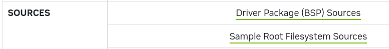

# src pack

https://developer.nvidia.com/embedded/jetson-linux-r362



## Driver Package (BSP) Sources

```
driver_pack_bsp_public_sources/Linux_for_Tegra/source/
├── argus_cam_libavencoder_src.tbz2
├── argus_cam_libavencoder_src.tbz2.sha1sum
├── atf_src.tbz2
├── atf_src.tbz2.sha1sum
├── dtc-1.4.5.tbz2
├── dtc-1.4.5.tbz2.sha1sum
├── gstegl_src.tbz2
├── gstegl_src.tbz2.sha1sum
├── gstjpeg_src.tbz2
├── gstjpeg_src.tbz2.sha1sum
├── gst-nvarguscamera_src.tbz2
├── gst-nvarguscamera_src.tbz2.sha1sum
├── gst-nvcompositor_src.tbz2
├── gst-nvcompositor_src.tbz2.sha1sum
├── gst-nvtee_src.tbz2
├── gst-nvtee_src.tbz2.sha1sum
├── gst-nvv4l2camera_src.tbz2
├── gst-nvv4l2camera_src.tbz2.sha1sum
├── gst-nvvidconv_src.tbz2
├── gst-nvvidconv_src.tbz2.sha1sum
├── gst-nvvideo4linux2_src.tbz2
├── gst-nvvideo4linux2_src.tbz2.sha1sum
├── kernel_oot_modules_src.tbz2
├── kernel_oot_modules_src.tbz2.sha1sum
├── kernel_src.tbz2
├── kernel_src.tbz2.sha1sum
├── libgstnvcustomhelper_src.tbz2
├── libgstnvcustomhelper_src.tbz2.sha1sum
├── libgstnvdrmvideosink_src.tbz2
├── libgstnvdrmvideosink_src.tbz2.sha1sum
├── libgstnvvideosinks_src.tbz2
├── libgstnvvideosinks_src.tbz2.sha1sum
├── libv4l2_nvargus_src.tbz2
├── libv4l2_nvargus_src.tbz2.sha1sum
├── nvgstapps_src.tbz2
├── nvgstapps_src.tbz2.sha1sum
├── nvidia-jetson-optee-source.tbz2
├── nvidia-jetson-optee-source.tbz2.sha1sum
├── nvidia_kernel_display_driver_source.tbz2
├── nvidia_kernel_display_driver_source.tbz2.sha1sum
├── nvidia_kernel_display_driver_source_without_root_dir.tbz2
├── nvidia_kernel_display_driver_source_without_root_dir.tbz2.sha1sum
├── nvidia-xconfig_src.tbz2
├── nvidia-xconfig_src.tbz2.sha1sum
├── nv_public_src_build.sh
├── nv_public_src_build_tos.sh
├── nvsample_cudaprocess_src.tbz2
├── nvsample_cudaprocess_src.tbz2.sha1sum
├── nvsci_headers.tbz2
├── nvsci_headers.tbz2.sha1sum
├── nvsci_samples_src.tbz2
├── nvsci_samples_src.tbz2.sha1sum
├── opencv_gst_samples_src.tbz2
├── opencv_gst_samples_src.tbz2.sha1sum
├── openwfd_headers.tbz2
├── openwfd_headers.tbz2.sha1sum
├── public_sources_sha.txt
├── spe-freertos-bsp.tbz2
├── spe-freertos-bsp.tbz2.sha1sum
├── v4l2_libs_src.tbz2
└── v4l2_libs_src.tbz2.sha1sum

```

## Sample Root Filesystem Sources

```
ls ubuntu_focal-l4t_aarch64_src  | wc
   3260

```